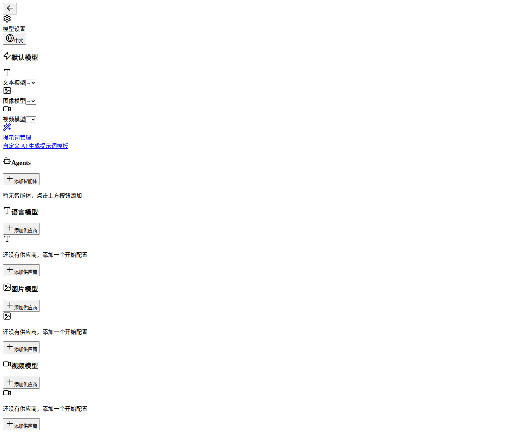

# AIComicWorkstation (AICF)

> v0.2.0 — MiniMax H3 结构化 Prompt 引擎 · 端到端 AI 漫剧生成器

从剧本到动画视频的全自动本地流水线。

## 界面预览

| 项目仪表盘 | 分镜编辑器 |
|---|---|
|  |  |

| 角色管理 | 模型配置 |
|---|---|
|  |  |

---

## 功能特性

- **剧本导入** — TXT/DOCX/PDF 文件上传，AI 自动解析文本、提取角色、智能分集
- **分集管理** — 项目级分集列表，角色按集关联
- **角色管理** — 主角/配角分区展示，支持跨集复用
- **角色四视图** — ComfyUI Qwen 工作流生成正面/四分之三/侧面/背面参考图
- **智能分镜** — LLM 将剧本拆解为专业镜头列表（构图、灯光、运镜指令）
- **首尾帧生成** — ComfyUI Qwen-Edit 工作流生成每镜头的起始帧和结束帧
- **视频生成** — ComfyUI H3 工作流基于首尾帧插值生成动画视频
- **H3 结构化 Prompt** — Base Mode (T2VA/I2VA/FL2VA) + Ref2VA Full-Reference Mode，对齐 MiniMax 官方格式
- **语言路由** — 中文剧本自动翻译为英文 body（IFF deepseek-v4-flash），对话保留 `<d>` 标签
- **视频合成** — FFmpeg 拼接所有片段为完整动画

## MiniMax H3 结构化 Prompt 引擎 (v0.2.0)

对齐 MiniMax H3 官方 `h3-prompt-writing` Skill 的 3 层上下文工程体系，通过单次 LLM 调用生成结构化视频提示词：

### 3 层架构

```
┌─────────────────────────────────────────┐
│  Layer 3: Guide (System Prompt)         │
│  角色定义 + 流程 + 关键原则              │
├─────────────────────────────────────────┤
│  Layer 2: Constraints (Format Rules)    │
│  时间分段 · 动作节拍 · 对白嵌入 · 运镜绑定│
├─────────────────────────────────────────┤
│  Layer 1: Content (Runtime Data)        │
│  剧本 · 角色 · 对话台本 · 帧锚点 · 场景 · 音频│
└─────────────────────────────────────────┘
```

### 核心特性

| 特性 | 说明 |
|------|------|
| **FL2VA 时间链** | 自动按持续时间拆分为 3-4 段时间节点，每段独立动作+运镜+对白 |
| **动作节拍引擎** | 每 2-3s 安排微动作节点，用「先…随即…然后…最终」因果推进链串联 |
| **对白自动注入** | 从 dialogue pipeline 提取台本，按 S1/S2 说话人 ID 嵌入对应时间段 |
| **中英双语** | 自动检测剧本语言，中文剧本→中文输出，英文→英文，`H3_LANGUAGE` 可强制 |
| **注册表管理** | Prompt 模板注册在 `prompt-templates` 系统，支持 UI 自定义覆盖 |
| **Ref2VA Full Reference** | 对齐 MiniMax 6 部分提示词架构（主体定义+摘要+保留+描述+声场+BGM） |

### 输出格式（Base Mode）

```
参考图与目标视频的对齐方式——<Picture 1> 对齐 0.00s；<Picture 2> 对齐 12.00s。

集成多模态描述 (integrated_multimodal_description):
0-4s: 电影级实拍，远景湖面火海初燃...镜头极慢速右摇...
4-8s: 中景船楼烈焰吞噬...镜头小幅推近...
8-12s: 全景拉远...焦木断裂...(S1)说：<d>[中文] 原文台词</d>

整体环境音 (overall_soundscape):
焦木爆裂与湖水沸腾交织...

非叙事音乐 (non_diegetic_music):
低沉稳重的大提琴以极慢节奏铺底...
```

## 架构

```
┌─────────────────────────────────────────────────────┐
│                    Pipeline Handlers                 │
│  character-image  │  frame-generate  │  video-gen    │
└────────┬──────────┴────────┬─────────┴───────┬──────┘
         │                   │                  │
┌────────▼───────────────────▼──────────────────▼──────┐
│              CompositeAIProvider (router)             │
│  generateText() │ generateImage() │ generateVideo()   │
└─────┬───────────┴──────┬─────────┴────────┬──────────┘
      │                  │                  │
┌─────▼──────┐  ┌───────▼──────────┐  ┌────▼──────────┐
│ IFF Proxy  │  │  Pipeline Engine │  │  Pipeline Eng │
│ :8999      │  │  (DAG executor)  │  │  (video path) │
│ gemma4     │  │  ┌──────────────┐│  │               │
│ deepseek   │  │  │ ComfyUI      ││  │  ComfyUI      │
└────────────┘  │  │ 7 atomic     ││  │  H3-i2v/r2v  │
                │  │ workflows    ││  └──────┬────────┘
                │  └──────────────┘│         │
                └───────┬──────────┘         │
                        │                    │
                ┌───────▼────────────────────▼──────┐
                │         ComfyUI :8188              │
                │  T2I │ Edit │ MultiAngle │ H3      │
                └────────────────────────────────────┘
```

### 三路路由

| 调用 | 路由 | 模型 |
|------|------|------|
| `generateText()` 纯文本 | IFF Proxy :8999 | 跟随模型选择器 |
| `generateText()` 带图片（VL） | IFF Proxy :8999 | 跟随模型选择器（图片自动压缩为 JPEG@85%/2048px） |
| `generateImage()` | ComfyUI :8188 | Qwen T2I / Edit / MultiAngle |
| `generateVideo()` | ComfyUI :8188 | H3 i2v / r2v / t2v |

全部 LLM 请求统一从 IFF Proxy 出入，本地 vLLM 和云端 API 由 IFF 根据 model 名路由。
VL 调用前自动压缩图片：resize 到最长边 2048px，转 JPEG 85% 质量。原始 5MB PNG → ~500KB，多图场景下确保请求体不超过 IFF 10MB 限制。

### ComfyUI 工作流

7 个原子工作流（位于 `ComfyUI/workflows/AIComicWorkstation/atomic/`）：

| 工作流 | 用途 | 模型 |
|--------|------|------|
| `qwen-2512-t2i` | 文生图 | Qwen 2.5 12B |
| `qwen-2511-edit` | 单角色参考图合成 | Qwen 2.5 VL 7B |
| `qwen-2511-edit-plus` | 多角色参考图合成 | Qwen 2.5 VL 7B |
| `qwen-2511-edit-multiangle` | 多角度图生成 | Qwen 2.5 VL 7B |
| `h3-t2v` | 文生视频 | MiniMax H3 |
| `h3-i2v` | 图生视频（含首尾帧） | MiniMax H3 |
| `h3-r2v` | 参考图生视频 | MiniMax H3 |

### Pipeline Engine

多步骤 DAG 编排引擎（`src/lib/pipeline-engine/`）：

- YAML 定义管线（inputs / steps / outputs + GPU 模型分类）
- 模板表达式解析（`${params.x}`、`${steps.y.z}`、`${params.arr[0]}`、`${params.seed + 1}`）
- GPU 调度：按模型家族分类，同族共享 GPU，异族释放
- Atomic + Script 两种步骤执行器
- 3 条预置管线：`character-image` / `frame-generate` / `video-generate`

## 技术栈

| 层级 | 技术 |
|------|------|
| 框架 | Next.js 16 (App Router, Turbopack) |
| 前端 | React 19, Tailwind CSS 4, Zustand |
| 数据库 | SQLite + Drizzle ORM |
| 图像/视频 | **ComfyUI** (本地) :8188 |
| 文本 LLM | **IFF Proxy** :8999 → 模型选择器配置 |
| VL 视觉 | **IFF Proxy** :8999 → 模型选择器配置（图片自动压缩） |
| 视频处理 | FFmpeg (fluent-ffmpeg) |
| 包管理 | pnpm / npm |

## 快速开始

### 环境要求

- Node.js 18+
- **ComfyUI**（localhost:8188）— 详见下方配置
- **IFF Proxy**（localhost:8999）— 文本/VL 统一网关
- FFmpeg

### 安装

```bash
git clone git@github.com:vincentlau2046-sudo/AIComicWorkstation.git
cd AIComicWorkstation
npm install
cp .env.example .env     # 配置本地模型地址
```

### 环境变量

```env
DATABASE_URL=file:./data/aicomic.db
UPLOAD_DIR=./uploads

# ComfyUI（图像/视频生成）
COMFYUI_BASE_URL=http://localhost:8188
COMFYUI_WORKFLOWS_DIR=/path/to/ComfyUI/workflows/AIComicWorkstation/atomic
COMFYUI_PIPELINES_DIR=./src/lib/pipeline-engine/pipelines

# IFF Proxy（文本+VL 统一网关）
OPENAI_BASE_URL=http://localhost:8999/v1
OPENAI_API_KEY=***
OPENAI_MODEL=gemma4-31b-vl
```

### 启动

```bash
npm run dev
```

访问 [http://localhost:3000](http://localhost:3000)

### 配置 ComfyUI 工作流

1. 将 `ComfyUI/workflows/AIComicWorkstation/atomic/` 目录复制到你的 ComfyUI 实例
2. 确保 7 个工作流 JSON + `meta.yaml` 文件在同一个扁平目录下
3. 安装必要节点：ComfyUI-Manager、ComfyUI-Qwen、MiniMax-H3 wrapper

## 项目结构

```
src/
├── app/
│   ├── [locale]/           # i18n 路由
│   │   ├── (dashboard)/    # 项目列表
│   │   ├── project/[id]/   # 项目编辑器
│   │   └── settings/       # 模型配置
│   └── api/                # API 路由
├── components/             # UI 组件
├── lib/
│   ├── ai/                 # AI 供应商层
│   │   ├── providers/      # OpenAI (IFF), ComfyUI
│   │   ├── composite-provider.ts  # 三路路由
│   │   ├── setup.ts        # 启动配置
│   │   └── types.ts
│   ├── comfyui/            # ComfyUI 客户端 + 工作流注册
│   │   ├── client.ts       # HTTP poll 客户端
│   │   ├── registry.ts     # meta.yaml 注册表
│   │   ├── executor.ts     # 工作流执行器
│   │   └── provider.ts     # ComfyUIProvider（AIProvider + VideoProvider）
│   ├── pipeline-engine/    # DAG 管线引擎
│   │   ├── pipelines/      # YAML 管线定义
│   │   ├── steps/          # Atomic/Script 执行器
│   │   ├── scripts/        # Python 后处理
│   │   ├── template.ts    # 模板解析
│   │   ├── executor.ts    # DAG 执行器
│   │   ├── gpu-scheduler.ts # GPU 调度
│   │   └─ types.ts
│   ├── pipeline/         # 业务处理器
│   │   ├── character-image.ts  # 角色四视图
│   │   ├── frame-generate.ts   # 首尾帧生成
│   │   └── video-generate.ts   # 视频生成
│   ├── db/
│   └── task-queue/         # 后台任务队列
└── stores/                  # Zustand 状态管理
```

## 版本

| 版本 | 内容 |
|------|------|
| v0.0.6 | H3 Motion Adapter LoRA + 720P upscale；environmentPrompts/characters/timeOfDay/timeline 完整写入 |
| v0.0.5 | R2V/FL2V 对齐 MiniMax H3 官方 shot-series 格式；角色参考图 guard ⑧ |
| v0.0.4 | R2V prompt-template 对齐 Ref2VA 6-section 格式 |
| v0.0.3 | FL2V 时间链 + 动作节拍引擎 + 中英双语路由 |
| v0.0.2 | 角色四视图 Pipeline；Phase Image 生成；Scope 三分类；Prompt 双语系统 |
| v0.0.1 | 初始版本 · ComfyUI 原子工作流 + Pipeline Engine + CompositeAIProvider |

### 近期修复（2026-08-28）

| 提交 | 说明 |
|------|------|
| `e22922a` | VL 图片发送前自动压缩为 JPEG@85%/2048px，解决 IFF 10MB 请求体限制 |
| `1d92293` | 移除 composite-provider 硬编码 VL_MODEL（qwen3-vl-4b）覆写，VL 调用跟随模型选择器 |
| `84242fb` | 修复 scene_frame_generate 单次 regenerate 时跳过已完成 asset 导致不生图的问题 |
| `aaccc42` | 修复 handleShotSplitStream 两个插入点遗漏 environmentPrompts/characters/timeOfDay/timeline |

## License

[Apache License 2.0](./LICENSE)